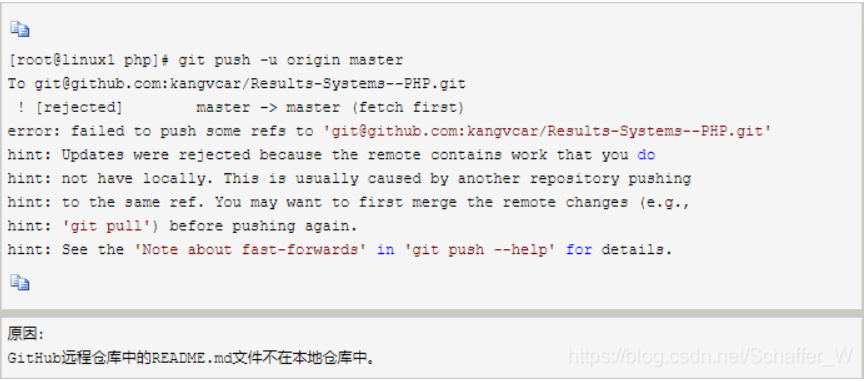

# 1、文件的基础本操作

1、添加文件到仓库

```shell
$  	git add test.txt
```

2、提交文件到仓库

```shell
$ 	git commit -m "a new file"
```

# 2、fetch和pull的区别

1、**FETCH_HEAD**: 是一个版本链接，记录在本地的一个文件中，指向着目前已经从远程仓库取下来的分支的末端版本

2、**commit-id**:在每次本地工作完成后，都会做一个**git commit**操作来保存当前工作到本地的repository， 此时会产生一个**commit-id**，这是一个能唯一标识一个版本的序列号。 在使用git push后，这个序列号还会同步到远程仓库。

3、有了以上的概念再来说说git fetch
	git fetch：这将更新git remote 中所有的远程仓库所包含分支的最新commit-id, 将其记录到.git/FETCH_HEAD文件中
**git fetch更新远程仓库的方式如下：**

```shell
git fetch origin master:temp 
#在本地新建一个temp分支，并将远程origin仓库的master分支代码下载到本地temp分支
git diff tmp 
#来比较本地代码与刚刚从远程下载下来的代码的区别
git merge tmp
#合并temp分支到本地的master分支
git branch -d temp
#如果不想保留temp分支 可以用这步删除
```

> git在本地会保存两个版本的仓库，分为本地仓库和远程仓库。本地仓库指的是本地的工作区，远程仓库指的是本地的版本库。pull命令是即更新了本地版本库也更新了工作区，fetch命令是只更新了本地的版本库；想要将本地版本库的代码更新到工作区还需要merge命令。

# 3、更新到代码仓库的步骤

1、第一步：

```shell
git add .#将当前目录加入到git（.点代表全部）
```

2、第二步

```shell
git commit -m "first commit（提交的描述信息）" 
# git提交到本地版本库
```

3、第三步

```shell
git remote add origin https://gitee.com/schaffer-w/yyplayer.git 
#git本地库连接远程版本库，这一步会有对应输入账号和密码的操作（配置过SSH公钥就没有了）
```

4、第四步

```shell
git push -u origin master
#将文件上传到远程版本库master分支
```

可能出现的错误



```shell
#解决方案1：
#我们只需加上 -f 参数即可push成功。

#解决方案2：
#我们只需加上 –rebase 参数然后再重新 push 一次即可。

git pull --rebase origin master 	#对应更新命令！
git push -u origin master #对应上传命令！
#（tips：我一般使用第二种方法）
```

# 4、其他命令

```shell
git status
# 作用：列出自己做出修改的文件（会有一个列表的！很重要的）
# 它会列出你修改的文件以及你新增的文件（删除的文件我还没试过）
```

