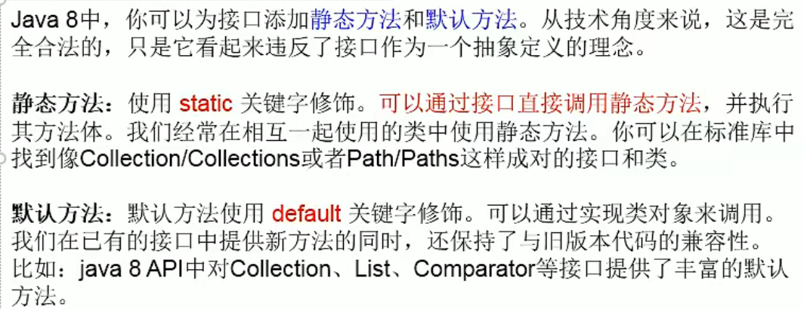
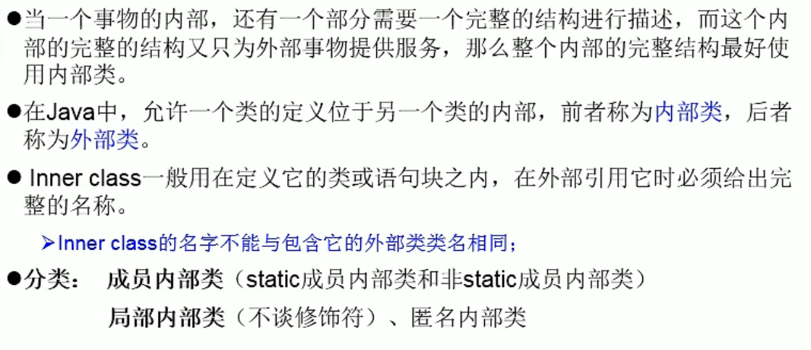
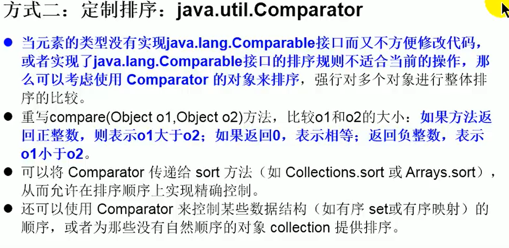
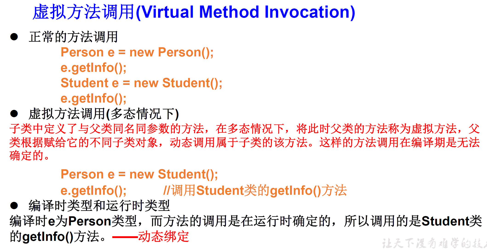
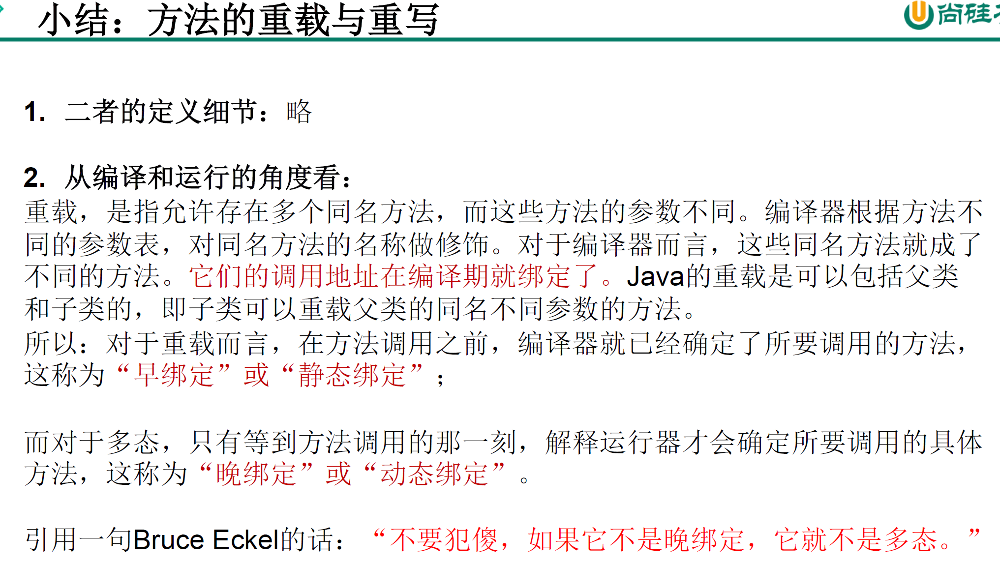

# 1、接口

1.1  **JDK7 **  之前，只能定义全局常量和抽象方法

**全局常量:`public static final` 修饰，书写时可以省略不写**

**抽象方法:`public abstract`修饰**

1.2   **JDK8 **  除了定义全局常量和抽象方法之外，还可以定义静态方法、默认方法(略)

```java
public interface CompareA {
    //静态方法
    public static void method1(){
        System.out.println("method1");
    }

    public default void method2(){
        System.out.println("method2");
    }

    //public已省略
    default void method3(){
        System.out.println("method3");
    }
}
interface CompareB{

    //public已省略
    default void method3(){
        System.out.println("method3");
    }
}
```
```java
public class SubClass {
    public static void main(String[] args) {
        Sub sub = new Sub();

//        public static void method1() 静态方法在子类中不可见
        //知识点1：接口中定义的静态方法，只能通过接口来调用,有点像工具类
//        sub.method1();
        CompareA.method1();//method1

        //知识点2：通过实现类的对象，可以调用接口中的默认方法
        //如果实现类重写了接口的默认方法，调用时，仍然调用的是重写以后的方法
        sub.method2();
        //知识点3：如果子类(或实现类)继承的父类和实现的接口中声明了同名同参数的默认方法，
        //那么子类在没有重写此方法的情况下，默认调用的是父类中同名同参数的方法 -->类优先原则
        //知识点4：如果实现类实现了多个接口，而这多个接口中定义了同名同参数的默认方法
        //那么在实现类没有重写此方法的情况下，报错。-->接口冲突
        //这就需要在实现类中重写此方法
        sub.method3();
    }
}

class Sub  implements CompareA,CompareB{
    @Override
    public void method3() {
        System.out.println("CompareA与CompareB都定义了同名同参数的默认方法，必须重写这个方法");
    }
}

class SuperClass {
    public void method3(){
        System.out.println("SuperClass.method3()");
    }
}


class Sub1  extends SuperClass implements CompareA,CompareB{
    @Override
    public void method3() {
        System.out.println("CompareA与CompareB都定义了同名同参数的默认方法，必须重写这个方法");
    }
    //知识点5：如何在子类(或实现类)的方法中调用父类、接口中被重写的方法
    public void myMethod(){
        method3();//调用自己定义的重写方法
        super.method3();//调用父类中声明的
        //调用接口中的默认方法
        CompareA.super.method3();
        CompareB.super.method3();

    }
}
```




# 2、内部类




```java
/**
 *  1、java中允许将一个类A声明在另一个类B中，则类A就是内部类，类B称为外部类
 *
 *  2、内部类的分类：成员内部类 VS 局部内部类(方法内、代码块内、构造器内)
 *
 *  3、成员内部类：
 *          一方面：作为外部类的成员
 *                  >调用外部类的结构
 *                  >可以被static修饰
 *                  >可以被4种不同的权限修饰
 *          另一方面，作为一个类：
 *                  >为内可以定义属性，方法，构造器等
 *                  >可以被final修饰，表示此类不能被继承。言外之意，不使用final就可以被继承
 *                  >可以被abstract修饰
 *
 *   4、关注如下的3个问题
 *          4.1、如何实现化成员内部类的对象
 *          4.2、如何在成员内部类中区分调用外部类的结构
 *          4.3、开发中局部内部类的使用
 */
public class InnerClassTest {
    public static void main(String[] args) {
        //创建Dog实例(静态成员内部类)：
        Person.Dog dog1 = new Person.Dog();
        Person.Dog dog2 = new Person.Dog();
        System.out.println(dog1 == dog2);
        dog1.show();

        //创建Bird实例(非静态的成员内部类)：
        //Person.Bird bird = new Person.Bird();//报错

        Person p = new Person();
        Person.Bird bird  = p.new Bird();
        bird.sing();
    }
}
class Person{
    String name;

    int age;

    public void eat(){
        System.out.println("eat()");
    }
    //静态成员内部类
     static class Dog{
        int age;
        public void show(){
            System.out.println(age);
        }
    }

    //非静态成员内部类
     class Bird{

        public Bird() {
        }

        String name;
        public void sing(){
            System.out.println(name);
            //调用外部类的非静态 属性
            Person.this.eat();//等价于eat();
        }
        public void display(String name){
            System.out.println(name);//方法的形参
            System.out.println(this.name);//内部类的属性
            System.out.println(Person.this.name);//外部类的属性
        }
    }

    public void method(){
        //局部内部类
        class AA{

        }
    }

    {
        //局部内部类
        class BB{

        }
    }

    public Person(){
        //局部内部类
        class CC{

        }
    }
}
```

# 3、Comparable与Comparator

```java
package com.atguigu.java;

import org.junit.Test;

import java.util.Arrays;
import java.util.Comparator;

/**
 * 一、说明：Java中的对象，正常情况下，只能进行比较：==  或  != 。不能使用 > 或 < 的
 *          但是在开发场景中，我们需要对多个对象进行排序，言外之意，就需要比较对象的大小。
 *          如何实现？使用两个接口中的任何一个：Comparable 或 Comparator
 *
 * 二、Comparable接口与Comparator的使用的对比：
 *    Comparable接口的方式一旦一定，保证Comparable接口实现类的对象在任何位置都可以比较大小。
 *    Comparator接口属于临时性的比较。
 *
 *
 *
 *
 *thor shkstart
 * @create 2019 下午 4:41
 */
public class CompareTest {
    /*
    Comparable接口的使用举例：  自然排序
    1.像String、包装类等实现了Comparable接口，重写了compareTo(obj)方法，给出了比较两个对象大小的方式。
    2.像String、包装类重写compareTo()方法以后，进行了从小到大的排列
    3. 重写compareTo(obj)的规则：
        如果当前对象this大于形参对象obj，则返回正整数，
        如果当前对象this小于形参对象obj，则返回负整数，
        如果当前对象this等于形参对象obj，则返回零。
    4. 对于自定义类来说，如果需要排序，我们可以让自定义类实现Comparable接口，重写compareTo(obj)方法。
       在compareTo(obj)方法中指明如何排序
     */
    @Test
    public void test1(){
        String[] arr = new String[]{"AA","CC","KK","MM","GG","JJ","DD"};
        //
        Arrays.sort(arr);

        System.out.println(Arrays.toString(arr));

    }

    @Test
    public void test2(){
        Goods[] arr = new Goods[5];
        arr[0] = new Goods("lenovoMouse",34);
        arr[1] = new Goods("dellMouse",43);
        arr[2] = new Goods("xiaomiMouse",12);
        arr[3] = new Goods("huaweiMouse",65);
        arr[4] = new Goods("microsoftMouse",43);

        Arrays.sort(arr);

        System.out.println(Arrays.toString(arr));
    }

    /*
    Comparator接口的使用：定制排序
    1.背景：
    当元素的类型没有实现java.lang.Comparable接口而又不方便修改代码，
    或者实现了java.lang.Comparable接口的排序规则不适合当前的操作，
    那么可以考虑使用 Comparator 的对象来排序
    2.重写compare(Object o1,Object o2)方法，比较o1和o2的大小：
    如果方法返回正整数，则表示o1大于o2；
    如果返回0，表示相等；
    返回负整数，表示o1小于o2。

     */
    @Test
    public void test3(){
        String[] arr = new String[]{"AA","CC","KK","MM","GG","JJ","DD"};
        Arrays.sort(arr,new Comparator(){

            //按照字符串从大到小的顺序排列
            @Override
            public int compare(Object o1, Object o2) {
                if(o1 instanceof String && o2 instanceof  String){
                    String s1 = (String) o1;
                    String s2 = (String) o2;
                    return -s1.compareTo(s2);//加一个负号就是从大到小排序
                }
//                return 0;
                throw new RuntimeException("输入的数据类型不一致");
            }
        });
        System.out.println(Arrays.toString(arr));
    }

    @Test
    public void test4(){
        Goods[] arr = new Goods[6];
        arr[0] = new Goods("lenovoMouse",34);
        arr[1] = new Goods("dellMouse",43);
        arr[2] = new Goods("xiaomiMouse",12);
        arr[3] = new Goods("huaweiMouse",65);
        arr[4] = new Goods("huaweiMouse",224);
        arr[5] = new Goods("microsoftMouse",43);

        Arrays.sort(arr, new Comparator() {
            //指明商品比较大小的方式:按照产品名称从低到高排序,再按照价格从高到低排序
            @Override
            public int compare(Object o1, Object o2) {
                if(o1 instanceof Goods && o2 instanceof Goods){
                    Goods g1 = (Goods)o1;
                    Goods g2 = (Goods)o2;
                    if(g1.getName().equals(g2.getName())){
                        return -Double.compare(g1.getPrice(),g2.getPrice());//从大到小
                    }else{
                        //String 默认实现了Comparable接口
                        return g1.getName().compareTo(g2.getName());//从小到大
                    }
                }
                throw new RuntimeException("输入的数据类型不一致");
            }
        });

        System.out.println(Arrays.toString(arr));
    }

}

```

```java
package com.atguigu.java;

/**
 * 商品类
 * @author shkstart
 * @create 2019 下午 4:52
 */
public class Goods implements  Comparable{

    private String name;
    private double price;

    public Goods() {
    }

    public Goods(String name, double price) {
        this.name = name;
        this.price = price;
    }

    public String getName() {
        return name;
    }

    public void setName(String name) {
        this.name = name;
    }

    public double getPrice() {
        return price;
    }

    public void setPrice(double price) {
        this.price = price;
    }

    @Override
    public String toString() {
        return "Goods{" +
                "name='" + name + '\'' +
                ", price=" + price +
                '}';
    }

    //指明商品比较大小的方式:按照价格从低到高排序,再按照产品名称从高到低排序
    @Override
    public int compareTo(Object o) {
//        System.out.println("**************");
        if(o instanceof Goods){
            Goods goods = (Goods)o;
            //方式一：
            if(this.price > goods.price){
                return 1;
            }else if(this.price < goods.price){
                return -1;
            }else{
//                return 0;
               return -this.name.compareTo(goods.name);
            }
            //方式二：
//           return Double.compare(this.price,goods.price);
        }
//        return 0;
        throw new RuntimeException("传入的数据类型不一致！");
    }
}

```



# 4、继承性

## 4.1、方法的重写

### 4.1.1 、什么是方法的重写(override 或 overwrite)？

​	子类继承父类以后，可以对父类中同名同参数的方法，进行覆盖操作.

### 4.1.2 、重写的规则
方法的声明： 权限修饰符  返回值类型  方法名(形参列表) throws 异常的类型{
 						//方法体
 					}

 * 		约定俗称：子类中的叫重写的方法，父类中的叫被重写的方法
 * 		① 子类重写的方法的方法名和形参列表与父类被重写的方法的方法名和形参列表相同
 *      ② 子类重写的方法的权限修饰符不小于父类被重写的方法的权限修饰符
 *      	>特殊情况：子类不能重写父类中声明为private权限的方法
 *      ③ 返回值类型：
 *      	>父类被重写的方法的返回值类型是void，则子类重写的方法的返回值类型只能是void
 *      	>父类被重写的方法的返回值类型是A类型，则子类重写的方法的返回值类型可以是A类或A类的子类
 *      	>父类被重写的方法的返回值类型是基本数据类型(比如：double)，则子类重写的方法的返回值类型必须是相同的基本数据类型(必须也是double)
 * ④ 子类重写的方法抛出的异常类型不大于父类被重写的方法抛出的异常类型（具体放到异常处理时候讲）

*   ***
 *    子类和父类中的同名同参数的方法要么都声明为非static的（考虑重写，要么都声明为static的（不是重写)。

# 5、多态性的理解

1、可以理解为一个事物的多种形态

2、对象的多态性：父类的引用指向子类的对象(或子类的对象赋给父类的引用)

3、多态的使用，虚拟方法调用

​	有了对象的多态性以后，我们在编译期，只能调用父类中声明的方法，但在运行期，我们实际执行的是子类重写父类的方法。

​	总结：**编译,看左边;运行，看右边**

4、多态性的使用前提，

​	4.1、类的继承关系

​	4.2、方法的重写

5、对象的多态性，只适用于方法，不适用于属性(编译和运行都看左边)





