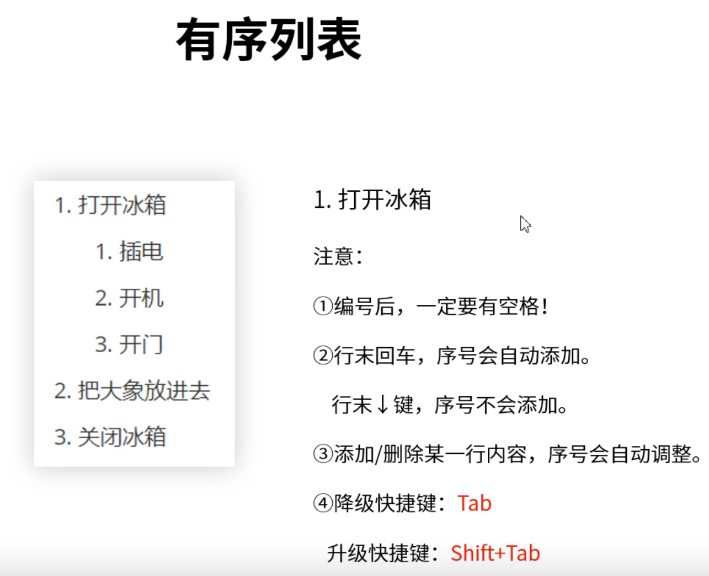
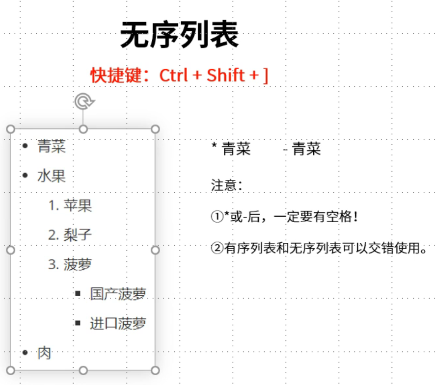
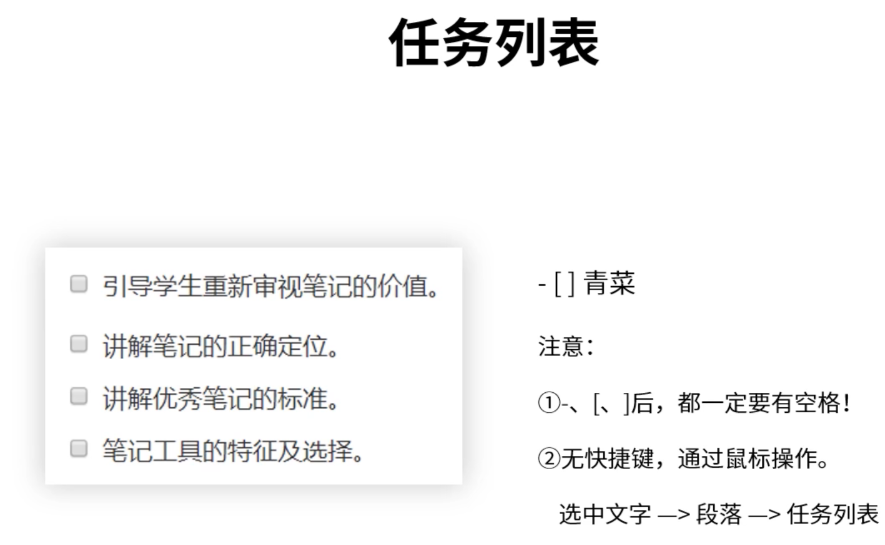
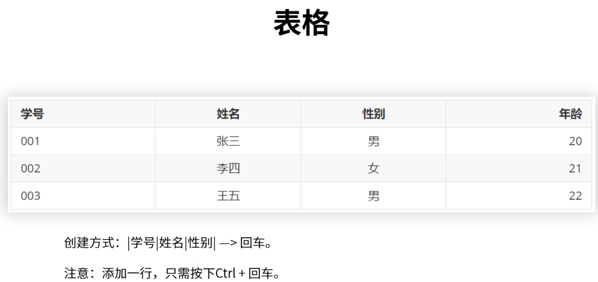
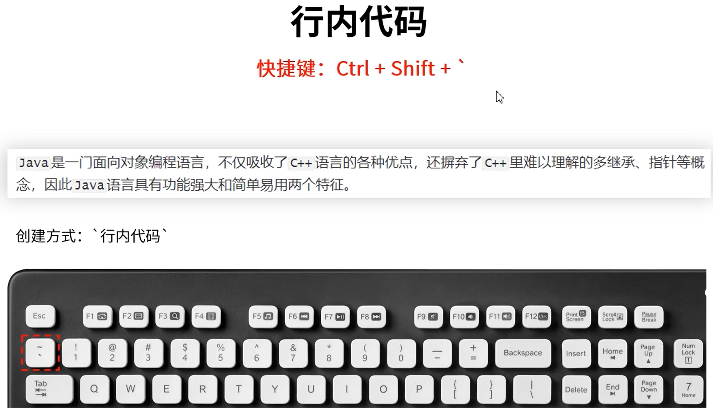
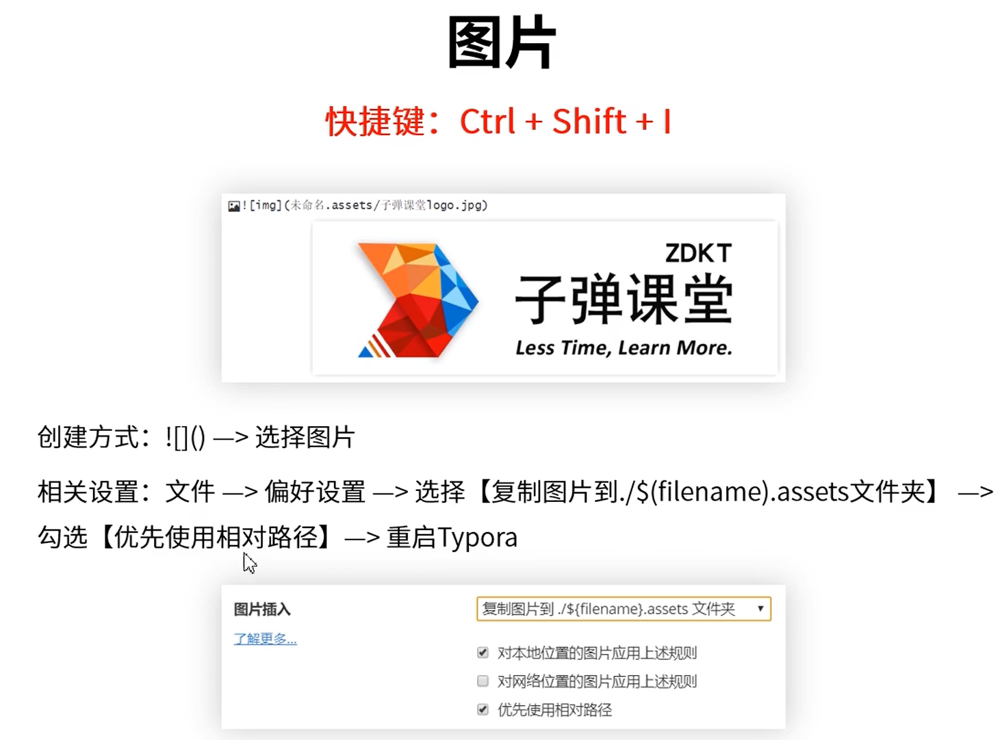
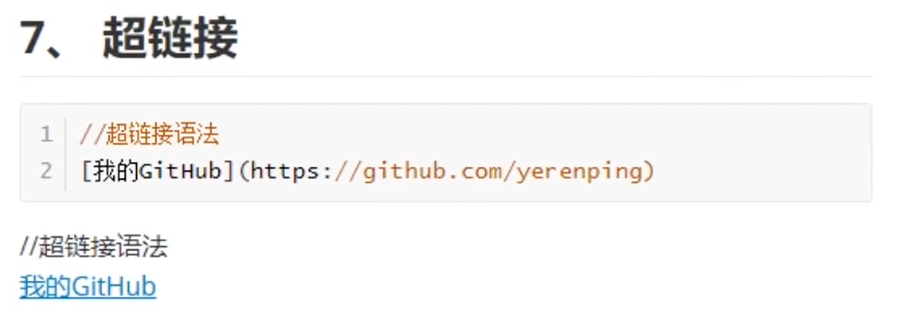

# 1. 有序列表

>  注意：不要忘记后面还有一个点.  (1. + 空格)
>
> 快捷键：可以同时选中多行，按 Ctrl + Shift + [ 同时给多行加编号

# 2. 无序列表

# 3. 任务列表

- [ ] 任务列表1
- [ ] 任务列表2

# 4、插入表格(Ctrl+T)

| 学号 | 姓名 | 性别 |
| :--: | :--: | :--: |
|  1   | 小一 |  男  |
|  2   | 小王 |  女  |

# 5、行内代码

# 6、插入图片

# 7、字体

# 8、引用

# 9、分割线

# 10、超链接

